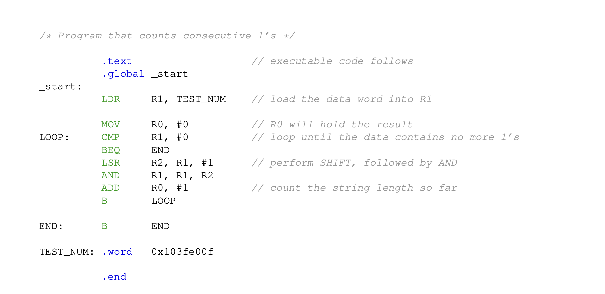
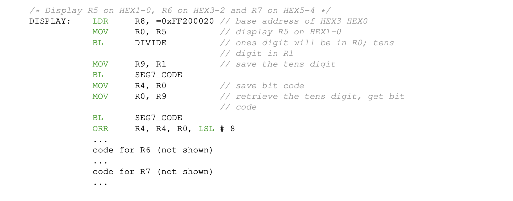

# COMP 231   Lab 2 - Introduction to Assembly Programming

This lab consists of four subproblems. For each one, you will need to
write a short ARM assembly language program and create a matching Altera
Monitor Program project. You will submit your work with GitHub
Classroom. Your lab submission should consist of four folders named
`part1`, `part2`, etc.

The purpose of this assignment is to gain familiarity with basic ARM
assembly programming, use use arithmetic and logic instructions, and to
interact with some of the simple output devices on the board.

# Part 1: A simple algorithm 

In the first part, you will need to construct a small program that
counts the longest string of 1's in a 32-bit word of data. For example,
if the input is `0x103fe00f`, the result should be 9.

1.  Create a folder called `part1` for the files that go with this part
    of the project. In this folder, create a new assembly program file
    called `part1.s`. You should take time and work through some
    examples to understand how this program works. (i.e. it's fair game
    to ask you questions about this algorithm later)

2.  Create a new Monitor Program project in the same folder. Use the
    DE10-Standard Computer.

3.  Compile and load the program onto the FPGA board. You should single
    step through this program to verify that it works and to help you
    understand the algorithm.

<figure id="fig:long" data-latex-placement="h">

<figcaption>Assembly code that finds the longest string of 1's</figcaption>
</figure>

# Part 2: Functions as blocks of re-usable code 

1.  Create a folder called `part2` for the files that go with this part
    of the project. Copy your `part1.s` file into this directory as
    `part2.s`.

2.  In `part2.s`, extract the code that calculates the longest sequence
    of ones and make it into a function. The function should be called
    `ONES`. Use register `r1` for the input, and `r0` for returning the
    result.

3.  At the `TEST_NUM` label in the program is the word used as an
    example above. Add at least four more 32-bit values after this that
    will be used to test your function. The list should be terminated
    with a zero to signal the end of the list (i.e. `.word 0`).

4.  In the `_start:` block, call the `ONES` program in a loop until it
    finds a zero. Track and store the longest sequence of ones into
    `r5`.

5.  Create a new Monitor Program project in the same folder. Use the
    DE10-Standard Computer. Compile and load the program onto the FPGA
    board. You should single step through this program to verify that it
    works correctly. Your program may be tested with values other than
    those included in the list.

# Part 3: Extending our program

Now we have a function that determines the longest string of ones, what
if we wanted to find some other attributes of our data? For example, we
could look for the longest string of zeros, or the longest string of
alternating zeros and ones.

Write a new program `part3.s` inside of a new `part3` folder that
computes the following:

-   The longest string of 1's (as before) in a function called `ones`

-   The longest string of 0's in a function called `zeros`

-   The longest string of alternating 1's and 0's (e.g. `1010101`) in a
    function called `alternate`. For example the string `101101010001`
    has a sequence of 6 alternating zeros and ones.

`ones()` should return its result in `r5`, `zeros()` in `r6`, and
`alternate()` in `r7`. To write the `alternate()` function, consider
what happens when a 32-bit string of alternating 0's and 1's is XORed
against another string.

Again, in your `_start:` block, call all three functions in a loop and
keep track of the longest sequences in registers `r8, r9`, and `r10`.

Create a new Monitor Program project and run/test your code so that it
works correctly.

# Part 4: Displaying our results

In part 3, we could only see the results of our calculations by
inspecting specific register values in the monitor program. To make our
program a little more useful we will add some more functionality to show
our results on the seven-segment displays that are on teh DE10 board.
The board has six 7-segment displays. Each display is capable of shwoing
a single hex digit from `0` to `F`. We will need two displays to show an
8-bit value (i.e. `00` to `FF`).\
You should copy over `part3.s` over to `part4.s` in a new folder and
extend your program to display all three of the string counts on the
seven segment displays. Show the longest string of 1's (`r8`) on
` HEX1–HEX0`, the longest string of 0's (`r9`) on `HEX3–HEX2`, and the
longest string of alternating bits (`r10`) on `HEX5–HEX4`.\
A *seven segment display* is a simple output device that is shown in
Fig. [2](#fig:ssd){reference-type="ref" reference="fig:ssd"}. The
display devices are *memory-mapped devices*, in that they have fixed
memory addresses. Performing a store operation to the device address
will turn on the lights that have ones in the corresponding bits, and
turn off those that are zero. The four displays corresponding to
` HEX3–HEX0` are controlled by writing a 32-bit value to memory address
` 0xff200020`. Similarly, `HEX5–HEX4` are controlled by the lowest 16
bits of the word at `0xff20030`. Only the seven bits for each display
are connected to wires -- any unused bits are discarded.

<figure id="fig:ssd" data-latex-placement="h">

<figcaption>Ports for 7-segment displays HEX5..HEX0</figcaption>
</figure>

To write an eight to the display, you would write a string of seven 1's
to the display. To write a one, you would write a string with 1's in the
1 and 2 position, but 0's in the other bits (0,3-6).\
You are given code for a function that provides the correct bit pattern
for the values `0x0` to `0xf` in
Fig. [3](#fig:bitcodes){reference-type="ref" reference="fig:bitcodes"}.
Note that the first entry in the `BIT_CODES:` array (`0x0`) has 1's in
bits 0-5, but bit 6 is zero. Similarly the next entry has bits 1 and 2
turned on, which would light up the right-most segments corresponding to
the number `0x1`.\
Lastly, the code in Fig. [4](#fig:display){reference-type="ref"
reference="fig:display"} provides some of the code that converts an
8-bit input value into two 4-bit values and displays them on the display
device.\
A couple of important nodes about the `DISPLAY` function. First, this
code uses the `DIVIDE` function from your lab 1. You should copy that
function into your `part4.s` file. Second, note that there will be only
a single *store* instruction to each of the display devices. You will
need to construct a single 32-bit value that has the bit patterns for
all of the displays you are using (4 for `HEX3–HEX0)` and 2 for
`HEX5–HEX4`).

<figure id="fig:bitcodes" data-latex-placement="h">

<figcaption>Subroutine to fetch bit patterns for use with 7-segment displays</figcaption>
</figure>

<figure id="fig:display" data-latex-placement="h">

<figcaption>Subroutine to display values on the 7-segment displays</figcaption>
</figure>

# Submission

When you have completed this entire exercise and have a functioning
program, submit your lab 2 project folder with four folders and four
project files via GitHub Classroom.
